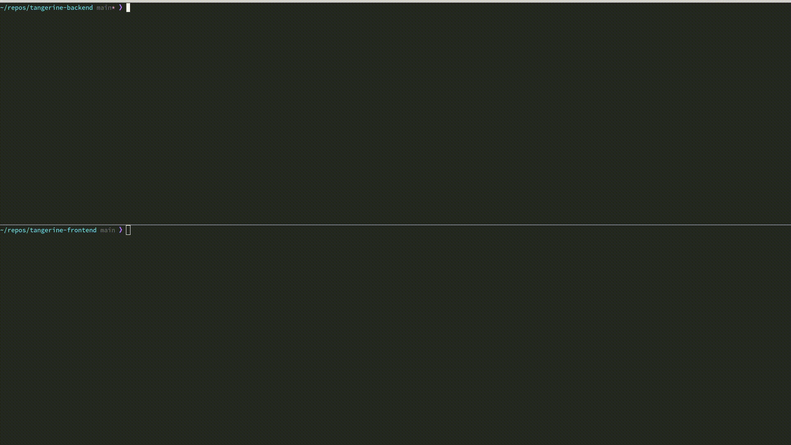
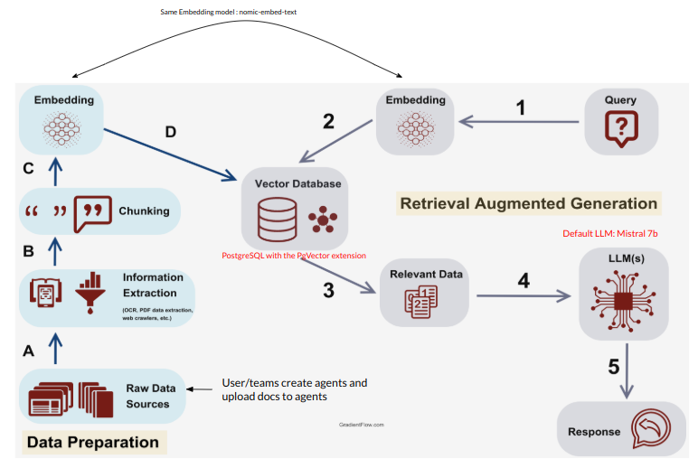

# 🍊 tangerine (backend) <!-- omit from toc -->

tangerine is a slim and light-weight RAG (Retieval Augmented Generated) system used to create and manage chat bot assistants.

Each assistant is intended to answer questions related to a set of documents known as a knowledge base (KB).



- [Overview](#overview)
  - [Architecture](#architecture)
    - [Data Preparation](#data-preparation)
    - [Retrieval Augmented Generation (RAG)](#retrieval-augmented-generation-rag)
    - [Document Processing](#document-processing)
    - [Document Processing Logic](#document-processing-logic)
  - [Purpose of Backend Service](#purpose-of-backend-service)
  - [Related Frontends](#related-frontends)
  - [Use of Hosted AI Services](#use-of-hosted-ai-services)
- [Local Envionment Setup](#local-envionment-setup)
  - [With Docker Compose](#with-docker-compose)
    - [Using huggingface text-embeddings-inference server to host embedding model (deprecated)](#using-huggingface-text-embeddings-inference-server-to-host-embedding-model-deprecated)
  - [Without Docker Compose](#without-docker-compose)
- [Developer Guide](#developer-guide)
  - [Install development packages](#install-development-packages)
  - [Using pre-commit](#using-pre-commit)
  - [Database Migrations](#database-migrations)
  - [Debugging in VSCode](#debugging-in-vscode)
- [Mac Development Tips](#mac-development-tips)
- [Synchronizing Documents from S3](#synchronizing-documents-from-s3)
  - [Continuous synchronization](#continuous-synchronization)
- [Deploying to OpenShift](#deploying-to-openshift)
- [Run Tangerine Frontend Locally](#run-tangerine-frontend-locally)
- [Available API Paths](#available-api-paths)

## Overview

tangerine implements a basic RAG architecture which relies on 4 key components:

- A vector database
  - (PostgresQL with the pgvector extension)
- A large language model (LLM)
  - This can be hosted by any OpenAI-compatible API service. Locally, you can use ollama
- An embedding model
  - This can be hosted on any OpenAI-compatible API service. Locally, you can use ollama
- (optional) An S3 bucket that you wish to sync documentation from.

This project is currently used by Red Hat's Hybrid Cloud Management Engineering Productivity Team.
It was born out of a hack-a-thon and is still a work in progress. You will find some areas of code well developed while others are in need of attention and some tweaks to make it production-ready are needed (with that said, the project *is* currently in good enough shape to provide a working chat bot system).

### Architecture



#### Data Preparation

- **A:** Documents are uploaded to the backend service
  - (alternatively, they can be sync'd from an AWS S3 bucket)
- **B:** The documents are processed/converted/cleaned up, see [Document Processing](#document-processing) below
- **C:** The documents are split into separate text chunks
- **D:** Embeddings are created for each text chunk and inserted into the vector database

#### Retrieval Augmented Generation (RAG)

- **1:** A user presents a question to an assistant in the chat interface
- **2:** Embeddings are created for the query using the embedding model
- **3:** A similarity search and a max marginal relevance search are performed against the vector DB to find the top N most relevant document chunks
  - The document set searched is scoped only to that specific assistant
- **4:** The LLM is prompted to answer the question using only the context found within the relevant document chunks
- **5:** The LLM response is streamed by the backend service to the user. Metadata containing the document chunks are also returned to be used as citations.

#### Document Processing

Document processing is arguably the most important part of a good RAG solution. The quality of the data stored within each text chunk is key to yielding accurate search results that will be passed to the LLM to "help it" answer a user's question.

Our documentation set has initially focused on pages that have been compiled using `mkdocs` or `antora`. Therefore, our processing logic has been highly focused on improving the data from those sources.

- Currently the well supported document formats include .md and .html pages compiled with 'mkdocs' or 'antora'.
- Support for .pdf, .txt, and .rst exists but the parsing is not yet well-optimized. Results may vary.
- Support for .adoc is a work-in-progress and relies on the ability of [docling](https://ds4sd.github.io/docling/) to parse the content

#### Document Processing Logic

- For markdown content, we:
  1. Replace very large code blocks with text that says "This is a large code block, go read the documentation for more information"

     - Large code blocks have a tedency to fill text chunks with "useless information" that do not help with answering a user's question

  2. Convert tables into plain text with with each row having "header: value" statements

     - This is intended to preserve the context of a large table across text chunks

  3. Fix relative links by replacing them with absolute URLs

     - This allows links within documentation to work when users review citation snippets

  4. Make some formatting optimizations such as removing extra whitespace, removing non-printable characters, etc.

- If we detect a .html page, we:

  1. Check if it was created with mkdocs or antora, and if so extract only the 'content' from the page body (remove header/footer/nav/etc.)

  2. Convert the page into markdown using `html2text`, then process it as a markdown document as described above

- When creating text chunks, we split documents into chunks of about 2000 characters with no overlap.
  - Sometimes the text splitter will create a very small chunk
    - In this case, we will "roll" the text from the small chunk into the next one
      - The goal is to fit as much "quality content" into a chunk as possible

### Purpose of Backend Service

The **tangerine-backend** service manages:

- Create/update/delete of chat bot "assistants" via REST API.
- Document ingestion
  - Upload via the API, or sync via an s3 bucket
  - Text cleanup/conversion
  - Chunking and embedding into the vector database.
- Querying the vector database.
- Interfacing with the LLM to prompt it and stream responses

### Related Frontends

The accompanying frontend service is [tangerine-frontend](https://github.com/RedHatInsights/tangerine-frontend) and a related plugin for [Red Hat Developer Hub](https://developers.redhat.com/rhdh/overview) can be found [here](https://github.com/RedHatInsights/backstage-plugin-ai-search-frontend)

### Use of Hosted AI Services

tangerine can be configured to use any OpenAI-compliant API service that is hosting a large language model or embedding model. In addition, the model you wish to use and the prompts to instruct them are fully customizable.

For example, to utilize a third party model hosting service, change the embedding model used, and adjust instruction prefix sent to the embedding model, the following environment variables could be set:

```sh
  LLM_BASE_URL=https://3rd-party-ai-service:443/v1
  LLM_MODEL_NAME=mistral-7b-instruct
  LLM_API_KEY=your-secret-key
  DEFAULT_SYSTEM_PROMPT="Your LLM system prompt here"
  EMBED_BASE_URL=https://3rd-party-ai-service:443/v1
  EMBED_MODEL_NAME=snowflake-arctic-embed-m-v1.5
  EMBED_API_KEY=your-secret-key
  EMBED_QUERY_PREFIX="Represent this sentence for searching relevant passages"
  EMBED_DOCUMENT_PREFIX=""
```

## Local Envionment Setup

A development/test environment can be set up with or without docker compose. In both cases, Ollama may be able to make use of your NVIDIA or AMD GPU (see more information about GPU support [here](https://github.com/ollama/ollama/blob/main/docs/gpu.md). On a Mac, Ollama must be run as a standalone application outside of Docker containers since Docker Desktop does not support GPUs.

### With Docker Compose

The docker compose file offers an easy way to spin up all components. [ollama](https://ollama.com) is used to host the LLM and embedding model. For utilization of your GPU, refer to the comments in the compose file to see which configurations to uncomment on the 'ollama' container. Postgres persists the data, and pgadmin allows you to query the database.

1. First, install Docker: [Follow the official guide for your OS](https://docs.docker.com/engine/install/)

     - NOTE: Currently, the compose file does not work with `podman`.

2. On Linux, be sure to run through the [postinstall steps](https://docs.docker.com/engine/install/linux-postinstall/)

3. Create the directory which will house the local environment data:

    ```text
    mkdir data
    ```

4. Invoke docker compose (postgres data will persist in `data/postgres`):

    ```text
    docker compose up --build
    ```

5. Pull the mistral LLM and nomic embedding model (data will persist in `data/ollama`):

    ```text
    docker exec tangerine-ollama ollama pull mistral
    docker exec tangerine-ollama ollama pull nomic-embed-text
    ```

6. Access the API on port `8000`

   ```sh
   curl -XGET 127.0.0.1:8000/api/assistants
   {
       "data": []
   }
   ```

7. (optional) Follow these steps to start the [tangerine-frontend](https://github.com/RedHatInsights/tangerine-frontend#with-docker-compose)

Note: You can access pgadmin at localhost:5050.

#### Using huggingface text-embeddings-inference server to host embedding model (deprecated)

ollama previously did not have an OpenAI compatible API path for interacting with an embedding models (i.e. `/v1/embeddings`). We previously used huggingface's [text-embeddings-inference](https://github.com/huggingface/text-embeddings-inference) server to host the embedding model. If you wish
to use this to test different embedding models that are not supported by ollama, follow these steps:

1. Make sure [git-lfs](https://git-lfs.com/) is installed:

    - Fedora: `sudo dnf install git-lfs`
    - MacOS: `brew install git-lfs`

    Then, activate it globally with:

    ```text
    git lfs install
    ```

2. Create a directory in the 'data' folder to house the embedding model and download the model, for example to use `nomic-embed-text-v1.5`:

    ```text
    mkdir data/embeddings
    git clone https://huggingface.co/nomic-ai/nomic-embed-text-v1.5 \
      data/embeddings/nomic-embed-text
    ```

3. Search for `uncomment to use huggingface text-embeddings-inference` in [./docker-compose.yml](docker-compose.yml) and uncomment all relevant lines

### Without Docker Compose

1. You'll need to have the following installed and working before proceeding:

   - `pipenv`
   - `pyenv`
   - `docker` or `podman`
   - (on Mac) `brew`

1. Install ollama

    - visit the [ollama download page](https://ollama.com/download)

    - (on Mac) you can use brew:

        ```text
        brew install ollama
        ```

1. Start ollama

    ```text
    ollama serve
    ```

1. Pull the language and embedding models

    ```text
    ollama pull mistral
    ollama pull nomic-embed-text
    ```

1. (on Mac) install the C API for Postgres (libpq)

    ```sh
    brew install libpq
    ```

    For Apple Silicon Macs, you'll need to export the following environment variables to avoid C library errors:

    ```text
    export PATH="/opt/homebrew/opt/libpq/bin:$PATH"
    export LDFLAGS="-L/opt/homebrew/opt/libpq/lib"
    export CPPFLAGS="-I/opt/homebrew/opt/libpq/include"
    ```

1. Create the directory to store postgresql data:

    ```text
    mkdir data
    ```

1. Start the vector database

    ```text
    docker run -d \
        -e POSTGRES_PASSWORD="citrus" \
        -e POSTGRES_USER="citrus" \
        -e POSTGRES_DB="citrus" \
        -e POSTGRES_HOST_AUTH_METHOD=trust \
        -v data/postgres:/var/lib/postgresql/data \
        -p 5432:5432 \
        pgvector/pgvector:pg16
    ```

1. Prepare your python virtual environment:

   ```sh
   pipenv install --dev
   pipenv shell
   ```

1. Start Tangerine Backend

    ```sh
    flask db upgrade && flask run
    ```

1. Access the API on port `8000`

    ```sh
    curl -XGET 127.0.0.1:8000/api/assistants
    {
       "data": []
    }
    ```

1. (optional) Follow these steps to start the [tangerine-frontend](https://github.com/RedHatInsights/tangerine-frontend#without-docker-compose)

## Developer Guide

### Install development packages

If desiring to make contributions, be sure to install the development packages:

```sh
pipenv install --dev
```

### Using pre-commit

This project uses pre-commit to handle formatting and linting.

- Before pushing a commit, you can run:

  ```sh
  pre-commit run --all
  ```

  and if it fails, check for changes the tool has made to your files.

- Alternatively, you can add pre-commit as a git hook with:

  ```sh
  pre-commit install
  ```

  and pre-commit will automatically be invoked every time you create a commit.

### Database Migrations
Tangerine uses [Flask Migrate](https://flask-migrate.readthedocs.io/en/latest/) to manage database migrations. After making changes to any of the models, update migrations with::

```bash
flask db migrate -m "Your migration message"
```

Then, to apply migrations to your local DB:

  1. Start the database. If using docker-compose, ensure that you start the DB but do not start the backend itself. Run:

      ```bash
      docker-compose start postgres
      ```

  1. Run the migrations:

      ```bash
      flask db upgrade
      ```

  1. After migrations are applied, you can invoke `docker compose up --build` as usual.

When deploying to OpenShift, the backend deploy template has an init container that runs `flask db upgrade` on start before the backend pod comes up.

### Debugging in VSCode

Run postgres and ollama either locally or in containers. Don't run the backend container. Click on "Run & Debug" in the left menu and then run the "Debug Tangerine Backend" debug target. You can now set breakpoints and inspect runtime state.

There's a second debug target for the unit tests if you want to run those in a debugger.

## Mac Development Tips

Ollama running in Docker on Apple Silicon cannot make use of hardware acceleration. That means the LLM will be very slow to respond running in Docker, even on a very capable machine.

However, running the ollama outside of Docker does make use of acceleration and is quite fast. If you are working on a Mac the best setup is to run the model through ollama locally and continue to run the other components (like the database) in Docker. The way the compose file is set up, the networking should allow this to work without issue.

Comment out `ollama` from the compose file, or stop the ollama container. Invoke `ollama serve` on your shell. For an optimal developer experience:

- run tangerine-backend in a debugger in VSCode
- run ollama directly on your host
- run postgres/pgadmin in Docker.

## Synchronizing Documents from S3

You can configure a set of assistants and continually sync their knowledge base via documents stored in an S3 bucket.

To do so you'll need to do the following:

1. Export environment variables that contain your S3 bucket auth info:

   ```sh
   export AWS_ACCESS_KEY_ID="MYKEYID"
   export AWS_DEFAULT_REGION="us-east-1"
   export AWS_ENDPOINT_URL_S3="https://s3.us-east-1.amazonaws.com"
   export AWS_SECRET_ACCESS_KEY="MYACCESSKEY"
   export BUCKET="mybucket"
   ```

   If using docker compose, store these environment variables in `.env`:

   ```sh
   echo 'AWS_ACCESS_KEY_ID=MYKEYID' >> .env
   echo 'AWS_DEFAULT_REGION=us-east-1' >> .env
   echo 'AWS_ENDPOINT_URL_S3=https://s3.us-east-1.amazonaws.com' >> .env
   echo 'AWS_SECRET_ACCESS_KEY=MYACCESSKEY' >> .env
   echo 'BUCKET=mybucket' >> .env
   ```

1. Create an `s3.yaml` file that describes your assistants and the documents they should ingest. See [s3-example.yaml](s3-example.yaml) for an example.

   If using docker compose, copy this config into your container:

   ```text
   docker cp s3.yaml tangerine-backend:/opt/app-root/src/s3.yaml
   ```

1. Run the S3 sync job:

    - With docker compose:

    ```text
    docker exec -ti tangerine-backend flask s3sync
    ```

    - Without:

    ```sh
    flask s3sync
    ```

The sync creates assistants and ingests the configured documents for each assistant. After initial creation, when the task is run it checks the S3 bucket for updates and will only re-ingest files into the vector DB when it detects file changes.

The OpenShift templates contain a CronJob configuration that is used to run this document sync repeatedly.

### Continuous synchronization

The s3 sync can be configured on a schedule to continually update your document knowledge bases. The sync logic works like this:

1. When documents are ingested, the s3 ETag is stored as metadata on the document chynks.
2. Whenever s3 sync runs, the bucket objects are checked for ETag changes.
3. If an object in s3 gets a new Etag, its document chunks are replaced in the vector DB.
4. The replacement takes an "active/standby" approach whereby:
   1. the document chunk initially has 'active: true' set on it (meaning it is used for RAG lookups)
   2. the newly inserted chunks are loaded with 'active: false'.
   3. once the entire document set has been ingested and is ready to use, the metadata is flipped so that the new chunks have 'active: true', and the old chunks have 'active: false'
   4. finally, chunks with 'active: false' are removed from the vector DB

## Deploying to OpenShift

This repository provides [OpenShift templates](openshift/) for all infrastructure components (except for the LLM hosting server). You may not need the templates for postgres or text-embeddings-inference server if you intend to provide those via other infrastructure or 3rd party services.

## Run Tangerine Frontend Locally

The API can be used to create/manage/update assistants, upload documents, and to chat with each assistant. However, the frontend provides a simpler interface to manage the service with. To run the UI in a development environment, see [tangerine-frontend](https://github.com/RedHatInsights/tangerine-frontend)

## Available API Paths

| Path                               | Method   | Description                |
| ---------------------------------- | -------- | -------------------------- |
| `/api/assistants`                      | `GET`    | Get a list of all assistants   |
| `/api/assistants`                      | `POST`   | Create a new assistant         |
| `/api/assistants/<id>`                 | `GET`    | Get an assistant               |
| `/api/assistants/<id>`                 | `PUT`    | Update an assistant            |
| `/api/assistants/<id>`                 | `DELETE` | Delete an assistant            |
| `/api/assistants/<id>/chat`            | `POST`   | Chat with an assistant         |
| `/api/assistants/<id>/documents`       | `POST`   | Assistant document uploads     |
| `/api/assistants/<id>/documents`       | `DELETE` | Delete assistant documents     |
| `/api/assistantDefaults`               | `GET`    | Get assistant default settings |
| `/ping`                            | `GET`    | Health check endpoint      |
